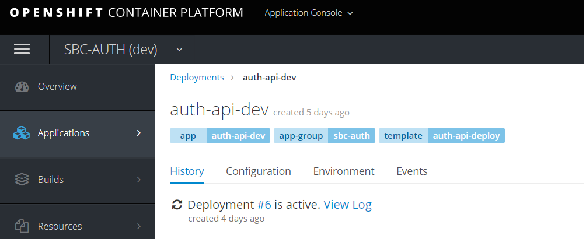

# Build and deploy to Openshsift

_This document will move to [LEAR Documentation](https://bcgov.github.io/lear/)._

## Important: Template and Label

All openshift objects should first be placed into the openshift template and set the correct label.



### Get all objects by label

```sh
oc get all,templates,configmap,secret,pvc -l app=auth-api
oc get all,templates,configmap,secret,pvc -l app-group=sbc-auth
oc get all,templates,configmap,secret,pvc -l template=auth-api-deploy
```

### Remove all objects by label

```sh
oc delete all,templates,configmap,secret,(pvc Danger!!) -l app=auth-api
```

### Create or update Secret(Configmap) ([Openshift Document](https://docs.openshift.com/container-platform/3.11/dev_guide/builds/build_inputs.html#using-secrets-during-build))

**Warning**: Don't put the real secret inside the template file.

> Create or update openshift template first and run the following command:

```sh
oc create secret generic my-secret \
      --from-literal=username=pwei123 \
      --from-literal=password=1234 \
      --type=kubernetes.io/basic-auth \
      --dry-run -o json \
   | oc apply -f -
```

> Add a new item to existing secret

```sh
oc get secret my-secret --export=true -o json \
   | jq ". * $(oc create secret generic my-secret --from-literal=POD_TESTING=true --type=kubernetes.io/basic-auth --dry-run -o json)" \
   | oc apply -f -
```

## API(s)

### Deploy API

1. Login to openshift

   ```sh
   oc login xxxxxxx
   ```

2. Switch to dev name space

   ```sh
   oc project 1rdehl-dev
   ```

3. Deploy database

   3.1 Deploy

   ```sh
   cd */sbc-auth/auth-db/openshift/templates
   oc process -f postgresql-deploy.json -p TAG_NAME=dev | oc apply -f -
   ```

   3.2 Create unit test user

   ```posgresql pod terminal
   psql postgres
   CREATE ROLE tester superuser;
   ALTER ROLE tester WITH LOGIN;
   ```

4. Create configmap and secrets

   ```sh
   cd */sbc-auth/auth-api/openshift/templates
   oc process -f auth-api-pre-deploy.json \
       -p NAME=auth-api \
       -p TAG_NAME=dev \
       -P JAEGER_COLLECTOR=--collector.host-port=jaeger-collector.d7eovc-dev.svc:14267 \
    | oc apply -f -
   ```

   Manually replace secret values in openshift Web Console or command line.

5. Create Deploy Config, Service and Route

   ```sh
   cd */sbc-auth/auth-api/openshift/templates
   oc process -f auth-api-deploy.json \
        -p NAME=auth-api \
        -p TAG_NAME=dev \
        -p REPLICAS=1 \
    | oc apply -f -
   ```

### Build API

1. switch to tools name space

   ```sh
   oc project 1rdehl-tools
   ```

2. Create build config and image

   ```sh
   oc process -f auth-api-build.json \
        -p NAME=auth-api \
        -p GIT_REPO_URL=https://github.com/bcgov/sbc-auth.git \
        -p GIT_REF=development \
    | oc apply -f -
   ```

3. Create pipeline

   ```sh
   oc process -f auth-api-pipeline.json \
        -p NAME=auth-api \
        -p TAG_NAME=dev \
        -p GIT_REPO_URL=https://github.com/bcgov/sbc-auth.git \
        -p GIT_REF=development \
        -p WEBHOOK=github-auth-api-dev \
        -p JENKINS_FILE=./jenkins/dev.groovy \
    | oc apply -f -
   ```

## WEB/UI (Runtime)

### Deploy Web Runtime

1. Login to openshift

   ```sh
   oc login xxxxxxx
   ```

2. Switch to dev name space

   ```sh
   oc project 1rdehl-dev
   ```

3. Create configmap and secrets

   ```sh
   cd */sbc-auth/auth-web/openshift/templates
   oc process -f auth-web-pre-deploy.json \
       -p NAME=auth-web \
       -p TAG_NAME=dev \
    | oc apply -f -
   ```

   Manually replace secret values in openshift Web Console or command line.

4. Create Deploy Config, Service and Route

   ```sh
   cd */sbc-auth/auth-web/openshift/templates
   oc process -f auth-web-deploy.json \
        -p NAME=auth-web \
        -p NAME_RUNTIME=auth-web-runtime \
        -p TAG_NAME=dev \
        -p REPLICAS=1 \
    | oc apply -f -
   ```

### Build Web and Runtime

1. switch to tools name space

   ```sh
   oc project 1rdehl-tools
   ```

2. Create Web build config and image

   ```sh
   oc process -f auth-web-build.json \
         -p NAME=auth-web \
         -p GIT_REPO_URL=https://github.com/bcgov/sbc-auth.git \
         -p GIT_REF=development \
    |  oc apply -f -
   ```

3. Create Web Runtime build config and image

   ```sh
   oc new-build --name auth-web-runtime --binary --strategy docker
   oc process -f auth-web-runtime-build.json \
      -p NAME=auth-web-runtime \
   | oc apply -f -
   ```

4. Create pipeline

   ```sh
   oc process -f auth-web-pipeline.json \
      -p NAME=auth-web \
      -p TAG_NAME=dev \
      -p GIT_REPO_URL=https://github.com/bcgov/sbc-auth.git \
      -p GIT_REF=development
      -p WEBHOOK=github-auth-web-dev \
      -p JENKINS_FILE=./jenkins/dev.groovy \
   | oc apply -f -
   ```
