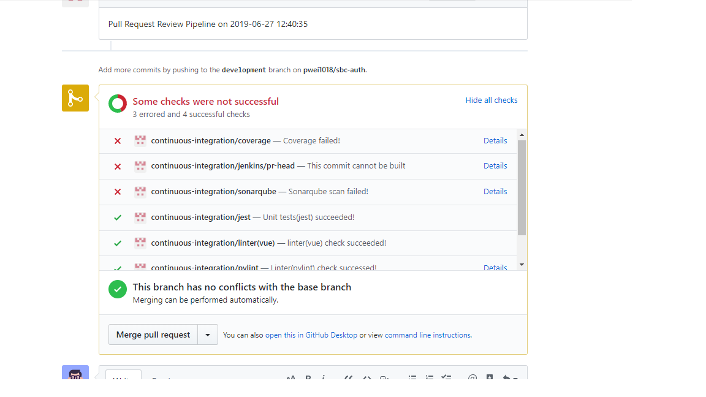
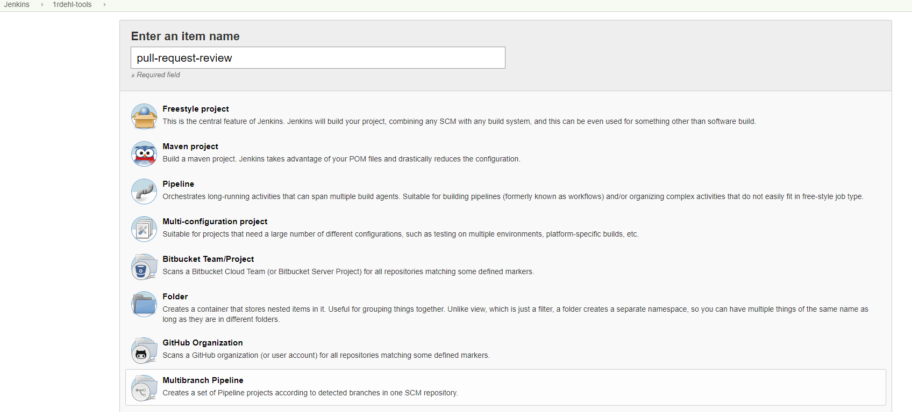
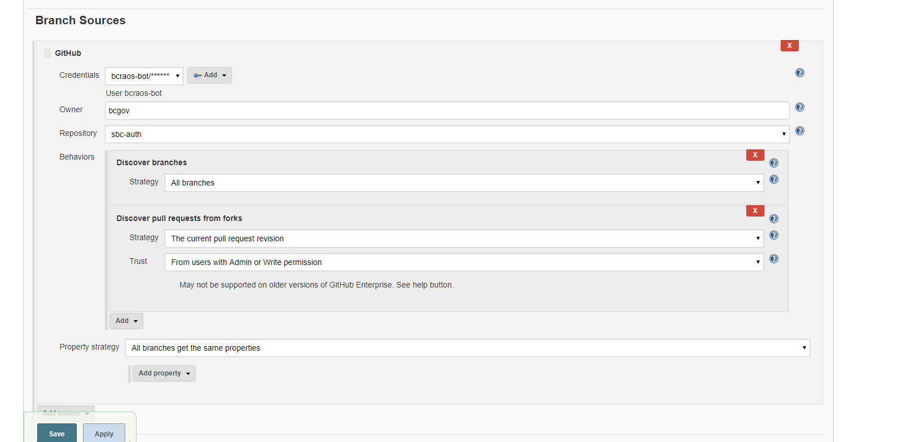
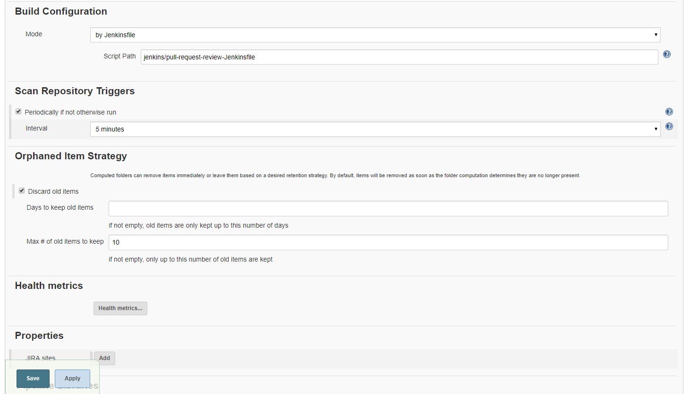
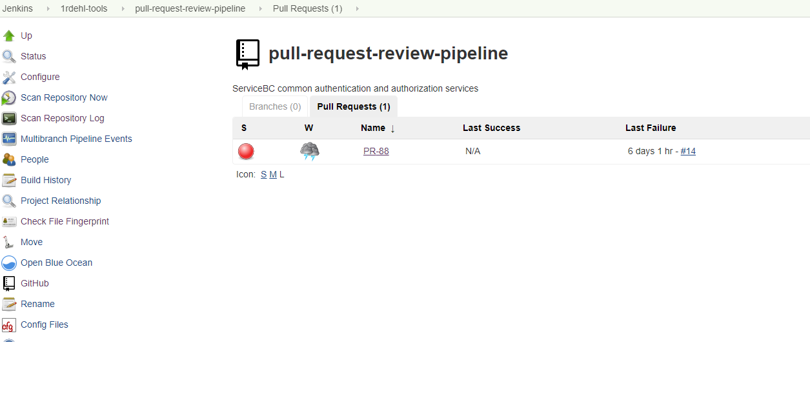

# Pull Request Review Pipeline Setup

*This document will move to [LEAR Documentation](https://bcgov.github.io/lear/).*

> Setup a Jenkins pipeline for pull request review.

1. Linter check (pylint eslint)
2. Unittest (pytest, jest test)
3. Coverage report
4. Sonarqube static code scan
5. Upload results to Sonarqube server
6. Sonarqube quality check through Quality Gate setting
7. Send Notification to Rocketchat channel
8. Post comment to Github
9. Post check status to Github



## Jenkins Pipeline

1. Copy [JenkinsFile](https://github.com/bcgov/sbc-auth/blob/development/jenkins/pull-request-review-Jenkinsfile) to your project
2. Modify environment variables in the JenkinsFile

## Openshift Jenkins Slave Image

> To make the pipeline run it need a Python 3.6 (or up) and NodeJS 8 (or up) environment

1. Copy [DockerFile](https://github.com/bcgov/sbc-auth/blob/development/openshift/dockerfile-jenkins-slave-python3-nodejs10) to your project
2. Build the images to your tools environment

    ```sh
    cat dockerfile-jenkins-slave-python3-nodejs10 | oc new-build -D - --name jenkins-slave-python3-nodejs10:latest
    ```

## Github Bot User

> We need to use this user accessing Github API to add comment or checks' status.

1. Create a Github Bot user or using existing user **bcraos-bot**
2. Give access of the repo to this user
3. Generate personal access token of this user and set it into Openshift's secret

## Rocketchat Bot User

> We need to use this user sending the notification to Rocketchat channels during the pipeline running.

1. Rocketchat app -> options -> Administration -> Integrations -> New integration -> Incoming WebHook
2. Fill the information and save it
3. Put the token into Openshift's secret

## Jenkins

1. Approve (Manage Jenkins -> In-process Script Approval) the following groovy packages permission for pipeline:

    ```text
        method groovy.json.JsonBuilder toPrettyString
        method groovy.json.JsonSlurperClassic parseText java.lang.String
        new groovy.json.JsonBuilder java.lang.Object
        new groovy.json.JsonSlurperClassic
        staticMethod org.codehaus.groovy.runtime.ScriptBytecodeAdapter unaryPlus java.lang.Object
    ```

2. Update all the plugins
3. Install Cobertura Plugin, SonarQube Scanner for Jenkins and Warnings Next Generation Plugin
4. Create "Multibranch Pipeline" under openshift project folder

5. Configure "Branch Sources"

6. Configure "Build Configuration"

7. Save and "Scan Repository Now"
8. Explore "Pull Requests" tab for existing Pull Requests

9. Done
